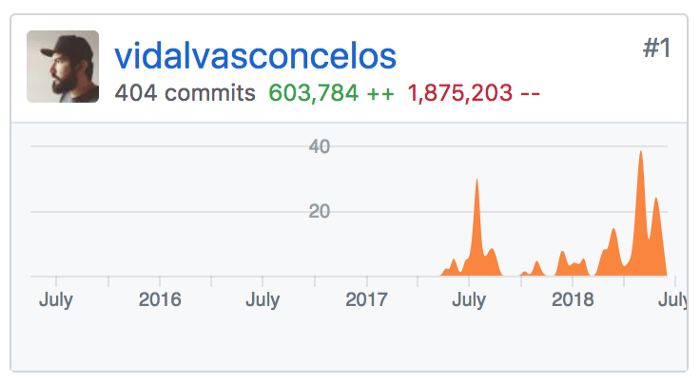

# Um resumo sobre um ano de B2rent

- Date: 2018, Jul 23

A mais ou menos um ano e muitos copos de café atrás, fui convidado a trabalhar em um projeto em Fortaleza. O que finalmente me fez mudar de cidade. Uma decisão que eu já postergava 2 anos, insistindo em ficar em Sobral.
O projeto era incrível, trabalhar em uma aplicação Laravel 5.1 que tinha como objetivo ajudar empresas a gerenciar locações, inicialmente eu seria o único Dev a frente dessa empreitada sendo o B2rent apenas um dos produtos da Pilps GP.
Eu me sentia o Dev perfeito para aquele trabalho, trabalhar com código legado, sob um ambiente de startups era quase que uma situação cotidiana naqueles últimos 2 anos. Esse período trabalhando como freelancer ou montando minha própria startup fora uma das melhores épocas da minha vida até então, conheci diversas pessoas que me ajudaram e mudaram radicalmente minha forma de ver o mundo, aquela energia de estar criando coisas novas e aprendendo a cada segundo é parte intrínseca do que sou hoje.

O desafio era aumentar as funcionalidade do projeto e enxugar o código o que eu posso afirmar era uma tarefa hercúlea, o maior exemplo que cito disso é que mesmo um ano depois ainda há Controllers que eu nunca pus as mãos. O grande motivo desse código tão inchado é que muitos Devs passaram por aquele código realizando demandas pontuais sem se importar com a manutenabilidade, cada um com uma visão diferente do que seria aquele projeto.

A maior parte das tarefas vinham sempre acompanhadas de refatorações extensas da base de código, retirando lógica de negócio dos Controllers, otimizando queries gigantescas, extraindo código inúteis e em boa parte das vezes tentando negociar questões de escopo. O que me fez aprender que boa parte do que deixa um software complexo é a falta de processo dos clientes. E parte do resultado desse trabalho pode ser visto aqui, esse gráfico demonstra o numero de linhas adicionadas e linhas removidas com que contribui para o b2. Esses números não são tão importantes assim, o mais relevante é quando você observa que mesmo o produto hoje tendo mais e mais features, conseguimos enxugar ao máximo essa codebase. 
  

    

O Frontend era outro desafio. O Laravel vem com uma estrutura pronta para trabalhar com Vue.js 1.0, estrutura essa que foi totalmente excluída no setup do projeto. Como eu era particularmente um fã dessa biblioteca uma das primeiras atividades foi recriar seu setup, mesmo embora naquela época a versão 2.0 já havia sido anunciada com algumas incompatibilidades criamos boa parte dos nossos componentes com o perfil que nova versão exigia.

A meta era diminuir a porcentagem de jQuery e Html, aumentando a do Vue, componentizando diversas partes da aplicação, além de é claro extirpar o Admin-lte da nossa app. Nada contra templates como este, mas se você não quer passar ao resto do mundo que você é só mais do mesmo, não use. Outra lição que aprendi é que para escalar você precisa ter uma estrutura simples, ágil e o menos engessada o possível, lição que tem me levado a pensar melhor sobre o uso de frameworks, mas isso fica para um próximo post. Nós evoluímos de um aplicação inchada e estática em um template admin para um app simples e enxuto.

Este não foi um trabalho exclusivo meu, mas tenho orgulho de ter liderado esse projeto, trabalhado na sua identidade e ajudado a desenhar cada feature que criamos. Este post parece um despedida, depois de um ano respirando esse projeto aconteceram tantas coisas. Nossa equipe cresceu e outros projetos que também cresceram dentro da Pilps, requerem meu tempo. 

Atualmente tenho trabalhado full time com typescript e essa mudança tem me motivado a escrever sobre.
Em um próximo post quero contar como migramos nosso frontend para o vue.js 2 + typescript e como isso ajudou nossa equipe a balancear o conhecimento entre todos os projetos.
